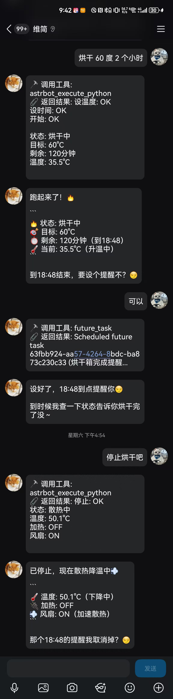
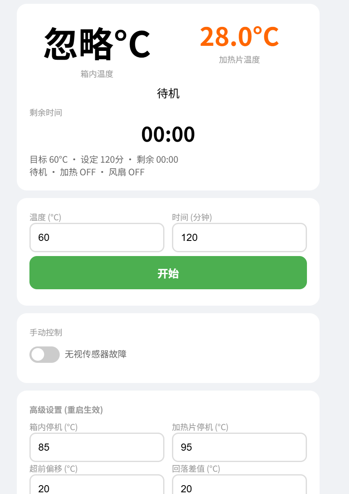
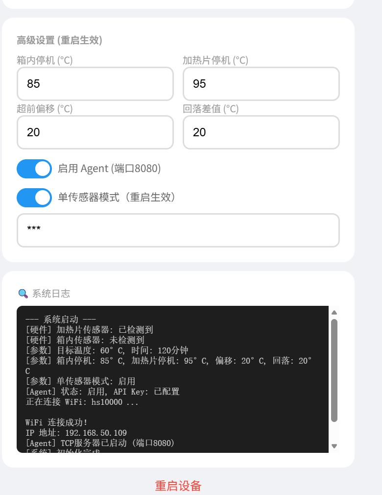

# 3D 打印耗材烘干箱控制系统

## 项目简介

本项目是一个基于 **ESP32-C3** 的智能烘干箱控制系统，专为 **3D 打印耗材（PLA、PETG、ABS 等）干燥** 设计。

系统通过 **双 DS18B20 温度传感器** 分别监测 **加热片表面温度** 和 **箱内环境温度**，采用 “加热片超前加热 + 箱内目标温度” 的双重控温策略，配合 **滞回比较算法** 精确控制加热片与风扇，确保箱内温度稳定在设定值附近，同时通过 **加热片过温保护** 和 **箱内过温保护** 双重安全保障，防止设备损坏或火灾风险。

本作品代码99%由ai生成，甚至连这个简介也是，相信你们也看出来了
---

## 核心特性

- 🔥 **双传感器智能温控**：加热片温度超前箱内温度，2个传感器可以单独启用
- 🛡️ **多重安全保护**：加热片过温立即停机、箱内过温强制散热、传感器故障自动停止加热
- 🌐 **Web 远程控制**：手机/电脑自适应界面，实时查看温度、状态、日志
- 🤖 **TCP Agent 接口**：开放 TCP API（端口 8080），支持智能体/脚本远程控制
- ⚙️ **丰富可配置参数**：停机阈值、超前偏移、回落差值等均可通过网页设置
- 📝 **内置日志系统**：桌面端网页实时显示系统运行日志，方便调试
- 🔄 **非阻塞架构**：温度读取不阻塞主循环，Web 服务始终流畅响应

---

## 硬件清单

| 器件 | 数量 | 说明 |
|------|------|------|
| ESP32-C3 开发板 | 1 | 主控 |
| DS18B20 温度传感器 | 2 | 加热片 ×1，箱内环境 ×1 |
| 4.7kΩ 上拉电阻 | 2 | 每个传感器数据脚一个 |
| 继电器模块 | 2 | 控制加热片和风扇 |
| 加热片 12v 100w（可自选）| 1 | 热源 |
| 12V 散热风扇 | 2 | 箱内空气循环 |
| 12v开关电源 | 1 | 供电 |
| 5vbec | 1 | 降压 |

---

## 技术栈

- **平台**：ESP32-C3 (RISC-V)
- **框架**：Arduino (PlatformIO)
- **传感器**：DS18B20 (OneWire + DallasTemperature 库)
- **网络**：WiFi + WebServer (端口 80) + TCP Server (端口 8080)
- **存储**：Preferences (NVS 持久化)

##内容
提供代码，3d简易外壳文件

##以下是web

我也不知道要写啥了，后面慢慢补充吧.
